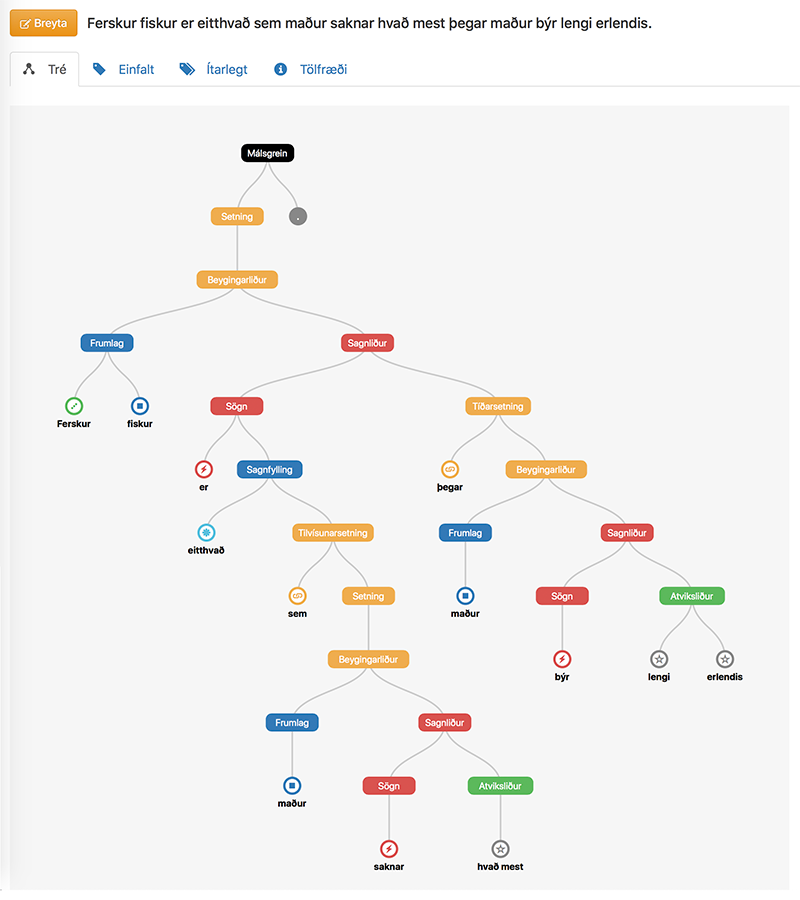

[](https://www.gnu.org/licenses/gpl-3.0)
[](https://www.python.org/downloads/release/python-370/)
[]()


# Greynir

### Natural Language Processing for Icelandic

*Greynir* is a natural language processing engine that
**extracts processable information from Icelandic text**, allows
**natural language querying** of that information and facilitates
**natural language understanding**. Greynir is the core of
[*Embla*](https://embla.is), a voice-driven virtual assistant app
for smartphones and tablets.

Try Greynir (in Icelandic) at [https://greynir.is](https://greynir.is)

Greynir periodically scrapes chunks of text from Icelandic news sites on the web.
It employs the [Tokenizer](https://github.com/mideind/Tokenizer) and
[GreynirPackage](https://github.com/mideind/GreynirPackage) modules (by the same authors)
to tokenize the text and parse the token streams according to a
**hand-written context-free grammar** for the Icelandic language.
The resulting parse forests are disambiguated using
scoring heuristics to find the best parse trees. The trees are then stored in a
database and processed by grammatical pattern matching modules to obtain statements
of fact and relations between stated facts.

An overview of the technology behind Greynir can be found in the paper
[A Wide-Coverage Context-Free Grammar for Icelandic
and an Accompanying Parsing System](https://acl-bg.org/proceedings/2019/RANLP%202019/pdf/RANLP160.pdf)
by Vilhjálmur Þorsteinsson, Hulda Óladóttir and Hrafn Loftsson *(Proceedings of Recent Advances in Natural Language Processing, pages 1397–1404, Varna, Bulgaria, Sep 2–4, 2019).*

<a href="https://raw.githubusercontent.com/mideind/Greynir/master/static/img/tree-example.png" title="Greynir parse tree">

</a>

*A parse tree as displayed by Greynir. Nouns and noun phrases are blue, verbs and verb phrases are red,
adjectives are green, prepositional and adverbial phrases are grey, etc.*

Greynir is most effective for text that is objective and factual, i.e. has a relatively high
ratio of concrete concepts such as numbers, amounts, dates, person and entity names,
etc.

Greynir is innovative in its ability to parse and disambiguate text written in a
**morphologically rich language**, i.e. Icelandic, which does not lend itself easily
to statistical parsing methods. Greynir uses grammatical feature agreement (cases, genders,
persons, number (singular/plural), verb tenses, modes, etc.) to guide and disambiguate
parses. Its highly optimized Earley-based parser, implemented in C++, is fast and compact
enough to make real-time while-you-wait analysis of web pages, as well as bulk
processing, feasible.

Greynir's goal is to "understand" text to a usable extent by parsing it into
structured, recursive trees that directly correspond to the original grammar.
These trees can then be further processed and acted upon by sets of Python
functions that are linked to grammar nonterminals.

**Greynir is currently able to parse about *90%* of sentences** in a typical news article from the web,
and many well-written articles can be parsed completely. It presently has over a million parsed articles
in its database, containing over 15 million parsed sentences. A recent version of this database is available
via the [GreynirCorpus](https://github.com/mideind/GreynirCorpus) project.

Greynir supports natural language querying of its databases. Users can ask about person names, titles and
entity definitions and get appropriate replies. The HTML5 Web Speech API is supported to allow
queries to be **recognized from speech** in enabled browsers, such as recent versions of Chrome.
Similarity queries are also supported, yielding articles that are similar in content to a given
search phrase or sentence.

Greynir may in due course be expanded, for instance:

* to make logical inferences from statements in its database;
* to find statements supporting or refuting a thesis; and/or
* to discover contradictions between statements.

## Implementation

Greynir is written in [Python 3](https://www.python.org/) except for its core
Earley-based parser module which is written in C++ and called
via [CFFI](https://cffi.readthedocs.org/en/latest/index.html).
Greynir requires Python 3.7 or later, and runs on CPython and
[PyPy](http://pypy.org/), with the latter being recommended for performance reasons.

Greynir works in stages, roughly as follows:

1. **Web scraper**, built on [BeautifulSoup](http://www.crummy.com/software/BeautifulSoup/)
  and [SQLAlchemy](http://www.sqlalchemy.org/) storing data
  in [PostgreSQL](http://www.postgresql.org/).
2. **Tokenizer** ([this one](https://github.com/mideind/Tokenizer)),
  extended to use the [BÍN](http://bin.arnastofnun.is/DMII/) database of Icelandic word forms for lemmatization and
  initial part-of-speech tagging.
3. **Parser** (from [this module](https://github.com/mideind/GreynirPackage)),
  using an improved version of the [Earley algorithm](http://en.wikipedia.org/wiki/Earley_parser)
  to parse text according to an unconstrained hand-written context-free grammar for Icelandic
  that may yield multiple parse trees (a parse forest) in case of ambiguity.
4. **Parse forest reducer** with heuristics to find the best parse tree.
5. **Information extractor** that maps a parse tree via its grammar constituents to plug-in
  Python functions.
6. **Article indexer** that transforms articles from bags-of-words to fixed-dimensional
  topic vectors using [Tf-Idf](http://www.tfidf.com/) and
  [Latent Semantic Analysis](https://en.wikipedia.org/wiki/Latent_semantic_analysis).
7. **Query processor** that supports a range of natural language queries
  (including queries about entities in Greynir's database).

Greynir has an embedded web server that displays news articles recently scraped into its
database, as well as names of people extracted from those articles along with their titles.
The web UI enables the user to type in any URL and have Greynir scrape it, tokenize it and
display the result as a web page. Queries can also be entered via the keyboard or using voice
input. The server runs on the [Flask](http://flask.pocoo.org/) framework, implements WSGI and
can for instance be plugged into [Gunicorn](http://gunicorn.org/) and
[nginx](https://www.nginx.com/).

The [tokenizer](https://github.com/mideind/Tokenizer) divides text chunks into
sentences and recognizes entities such as dates, numbers,
amounts and person names, as well as common abbreviations and punctuation.

Grammar rules are laid out in a separate text file,
[`Greynir.grammar`](https://github.com/mideind/GreynirPackage/blob/master/src/reynir/Greynir.grammar),
which is a part of [GreynirPackage](https://github.com/mideind/GreynirPackage). The standard
[Backus-Naur form](http://en.wikipedia.org/wiki/Backus%E2%80%93Naur_Form) has been
augmented with repeat specifiers for right-hand-side tokens (`*` for 0..n instances,
`+` for 1..n instances, or `?` for 0..1 instances). Also, the grammar allows for
compact specification of rules with variants, for instance due to cases, numbers and genders.
Thus, a single rule (e.g. `NounPhrase/case/gender → Adjective/case noun/case/gender`)
is automatically expanded into multiple rules (12 in this case, 4 cases x 3 genders) with
appropriate substitutions for right-hand-side tokens depending on their local variants.

The parser is an optimized C++ implementation of an Earley parser as enhanced by
[Scott and Johnstone](http://www.sciencedirect.com/science/article/pii/S0167642309000951),
referencing Tomita. It parses ambiguous grammars without restriction and
returns a compact Shared Packed Parse Forest (SPPF) of parse trees. If a parse
fails, it identifies the token at which no parse was available.

The Greynir scraper is typically run in a `cron` job every 30 minutes to extract
articles automatically from the web, parse them and store the resulting trees
in a PostgreSQL database for further processing.

Scraper modules for new websites are plugged in by adding Python code to the
[`scrapers/`](scrapers/) directory. Currently, the [`scrapers/default.py`](scrapers/default.py)
module supports a wide range of popular Icelandic news sites.

Processor modules can be plugged into Greynir by adding Python code to the
[`processors/`](processors/) directory. The module [`processors/persons.py`](processors/persons.py),
for example, extracts person names and titles from parse trees for storage in a database table.

Query (question answering) modules can be plugged into Greynir by adding Python code to
the [`queries/`](queries/) directory. Reference implementations for several query types
can be found in that directory, for instance [`queries/builtin.py`](queries/builtin.py)
which supports questions about persons and titles. Query module examples can be viewed
in [`queries/examples`](queries/examples).

## File details

* [`article.py`](article.py): Representation of an article through its life cycle
* [`config/Greynir.conf`](config/Greynir.conf): Editable configuration file
* [`db/*.py`](db/): Database models, queries and functions via SQLAlchemy
* [`fetcher.py`](fetcher.py): Utility classes for fetching articles given their URLs
* [`geo.py`](geo.py): Geography and location-related utility functions
* [`main.py`](main.py): WSGI web server application and main module for command-line invocation
* [`nertokenizer.py`](nertokenizer.py): A layer on top of the tokenizer for named entity recognition
* [`postagger.py`](postagger.py): Part-of-speech tagging
* [`processor.py`](processor.py): Information extraction from parse trees and token streams
* [`queries/*.py`](queries/): Natural language query processor and query-answering modules
* [`routes/*.py`](routes/): Routes for the web application
* [`scraper.py`](scraper.py): Web scraper, collecting articles from a set of pre-selected websites
* [`scrapers/*.py`](scrapers): Scraper code for various websites
* [`settings.py`](settings.py): Management of global settings and configuration data
* [`speak.py`](speak.py): Command line interface for speech synthesis
* [`speech/*.py`](speech/): Speech synthesizer modules
* [`tnttagger.py`](tnttagger.py): Statistical Part-of-speech tagging
* [`tools/*.py`](tools/): Various command line utility tools
* [`tree.py`](tree.py): Representation of parse trees for processing
* [`treeutil.py`](treeutil.py): Utility functions for working with parse trees and tokens
* [`utility.py`](utility.py): Assorted utility functions used throughout the codebase
* [`vectors/builder.py`](vectors/builder.py): Article indexer and LSA topic vector builder

## Installation and setup

* [Instructions for Ubuntu/Debian GNU/Linux](docs/setup_linux.md)
* [Instructions for macOS](docs/setup_macos.md)
* [Docker container](https://github.com/vthorsteinsson/greynir-docker)

## Running Greynir

Once you have followed the installation and setup instructions above, change to the
Greynir repository and activate the virtual environment:

```
cd Greynir
venv/bin/activate
```

You should now be able to run Greynir.

### Web application

```
python main.py
```

Defaults to running on [`localhost:5000`](http://localhost:5000) but this can be
changed in [`config/Greynir.conf`](config/Greynir.conf).

### Web scrapers

```
python scraper.py
```

If you are running the scraper on macOS, you may run into problems with Python's `fork()`.
This can be fixed by setting the following environment variable in your shell:

```
export OBJC_DISABLE_INITIALIZE_FORK_SAFETY=YES
```

### Processors

```
python processor.py
```

This will run all processors in the `processors` directory on any unprocessed articles
in the database.

### Interactive shell

You can launch an [IPython](https://ipython.org) REPL shell with a database session (`s`), the Greynir
parser (`r`) and all SQLAlchemy database models preloaded. See [Using the Greynir Shell](docs/shell.md)
for instructions.

## Contributing

See [Contributing to Greynir](CONTRIBUTING.md).

## License

Greynir is Copyright &copy; 2023 [Miðeind ehf.](https://mideind.is)  
The original author of this software is *Vilhjálmur Þorsteinsson*.

<a href="https://mideind.is"></a>

This set of programs is free software: you can redistribute it and/or modify it
under the terms of the GNU General Public License as published by the Free
Software Foundation, either version 3 of the License, or (at your option) any later
version.

This set of programs is distributed in the hope that it will be useful, but WITHOUT
ANY WARRANTY; without even the implied warranty of MERCHANTABILITY or FITNESS FOR
A PARTICULAR PURPOSE. See the GNU General Public License for more details.

<a href="https://www.gnu.org/licenses/gpl-3.0.html"></a>

The full text of the GNU General Public License v3 is
[included here](https://github.com/mideind/Greynir/blob/master/LICENSE.txt)
and also available here: [https://www.gnu.org/licenses/gpl-3.0.html](https://www.gnu.org/licenses/gpl-3.0.html).

If you wish to use this set of programs in ways that are not covered under the
GNU GPLv3 license, please contact us at [mideind@mideind.is](mailto:mideind@mideind.is)
to negotiate a custom license. This applies for instance if you want to include or use
this software, in part or in full, in other software that is not licensed under
GNU GPLv3 or other compatible licenses.

## Acknowledgements

Greynir uses the official BÍN ([Beygingarlýsing íslensks nútímamáls](https://bin.arnastofnun.is))
lexicon and database of Icelandic word forms to identify words and find their
potential meanings and lemmas. The database is included in
[BinPackage](https://github.com/mideind/BinPackage) in compressed form.
BÍN is licensed under CC-BY-4.0, and credit is hereby given as follows:

*Beygingarlýsing íslensks nútímamáls. Stofnun Árna Magnússonar í íslenskum fræðum. Höfundur og ritstjóri Kristín Bjarnadóttir.*

The Greynir web interface uses map data from [OpenStreetMap](https://www.openstreetmap.org),
[Google](https://maps.google.com) and [Wikipedia](https://is.wikipedia.org).
